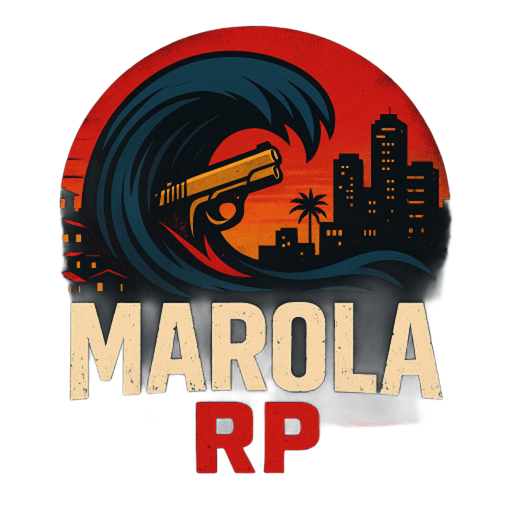

	

	
	
	
	
	

	<b>Plano de ação estratégico para evolução do projeto Marola RP</b> 
	<i>Documentação alinhada aos padrões modernos da comunidade dev sênior</i>

---

Este plano segue referências modernas da comunidade dev, incorporando OKRs, ownership, checkpoints, automação, frameworks ágeis e indicadores mensuráveis. Cada etapa traz entregáveis claros, templates de acompanhamento e práticas de feedback contínuo.

---

## Etapa 1: Organização e Estrutura
**OKR:** Garantir estrutura organizada e padronizada para facilitar manutenção e escalabilidade.
- Revisar e reestruturar diretórios (resources, configs, scripts, cache)
	- Exemplo: Separar recursos por categoria ([empregos], [veiculos], [scripts], etc.)
- Padronizar nomes de arquivos e pastas
	- Sugestão: Usar nomes descritivos e evitar abreviações confusas
- Criar/atualizar manifestos (fxmanifest.lua/__resource.lua) em todos os recursos
	- Ferramenta recomendada: Script de verificação automática
- Documentar estrutura no README
	- Entregável: Diagrama da estrutura de pastas
**Boas práticas:**
	- Manter um padrão de versionamento para recursos
	- Utilizar templates para novos recursos
**Entregáveis:**
	- Diagrama atualizado da estrutura de pastas
	- Checklist de manifestos
	- Template de novos recursos
**Checkpoints:** Revisão semanal da estrutura e documentação
**Ownership:** Dev Lead
**Critério de sucesso:** Estrutura clara, sem arquivos órfãos ou duplicados

## Etapa 2: Auditoria Técnica
**OKR:** Garantir 100% dos recursos funcionando sem erros críticos e com segurança reforçada.
- Testar todos os recursos individualmente
	- Ferramenta: Testes automatizados (ex: CI/CD com GitHub Actions)
- Corrigir dependências quebradas e erros de inicialização
	- Exemplo: Verificar logs de inicialização do servidor
- Validar integrações (oxmysql, VRP, scripts customizados)
	- Checklist: Testar comandos SQL, autenticação, permissões
- Revisar permissões e segurança dos scripts
	- Sugestão: Usar linters e scanners de segurança
**Boas práticas:**
	- Documentar todos os testes realizados
	- Manter registro de bugs e correções
**Entregáveis:**
	- Relatório de testes automatizados
	- Registro de bugs e correções
**Checkpoints:** Testes automatizados a cada commit
**Ownership:** Equipe de Desenvolvimento
**Critério de sucesso:** Todos os recursos iniciam sem erros

## Etapa 3: Melhoria de Experiência do Jogador
**OKR:** Aumentar retenção e satisfação dos jogadores em 20% nos próximos 3 meses.
- Revisar e balancear empregos, facções e atividades
	- Ferramenta: Planilha de balanceamento, enquetes com jogadores
- Corrigir bugs reportados pela comunidade
	- Processo: Sistema de tickets e changelog público
- Implementar novos sistemas (ex: inventário, economia, eventos)
	- Exemplo: Sistema de crafting, eventos sazonais
- Melhorar interface e feedbacks visuais
	- Sugestão: Utilizar frameworks de UI modernos (ex: NUI)
**Boas práticas:**
	- Realizar playtests regulares
	- Coletar métricas de engajamento
**Entregáveis:**
	- Relatório de playtests
	- Métricas de engajamento
	- Changelog público
**Checkpoints:** Sprints quinzenais de melhorias
**Ownership:** Devs + Community Manager
**Critério de sucesso:** Feedback positivo dos jogadores, aumento de retenção

## Etapa 4: Documentação e Suporte
**OKR:** Reduzir tempo de onboarding de novos devs para menos de 3 dias.
- Atualizar README e criar Wiki interna
	- Ferramenta: GitHub Wiki, Notion
- Documentar APIs, endpoints e integrações
	- Entregável: Swagger/OpenAPI para endpoints
- Criar guias de instalação, configuração e troubleshooting
	- Exemplo: Tutorial em vídeo, FAQ
- Definir canal oficial de suporte (Discord, email)
	- Sugestão: Bot de automação para dúvidas frequentes
**Boas práticas:**
	- Manter documentação sempre atualizada após cada sprint
	- Incentivar devs a contribuir com exemplos e tutoriais
**Entregáveis:**
	- Wiki interna atualizada
	- Tutoriais em vídeo
	- FAQ automatizado
**Checkpoints:** Revisão da documentação a cada sprint
**Ownership:** Dev Lead / Suporte
**Critério de sucesso:** Novos devs conseguem contribuir rapidamente

## Etapa 5: Gestão de Versionamento e Deploy
**OKR:** Realizar deploys sem downtime e com rollback em menos de 10 minutos.
- Implementar fluxo de versionamento (Git, tags, changelog)
	- Ferramenta: GitHub, GitLab, Conventional Commits
- Automatizar deploy e backups
	- Exemplo: Scripts de backup diário, deploy automatizado via CI/CD
- Testar atualizações em ambiente de staging
	- Sugestão: Ambiente de testes isolado
- Definir política de rollback
	- Entregável: Guia rápido de rollback
**Boas práticas:**
	- Realizar deploys fora do horário de pico
	- Manter backups em local seguro
**Entregáveis:**
	- Changelog detalhado
	- Scripts de automação de deploy e backup
	- Guia de rollback
**Checkpoints:** Deploys agendados e revisados
**Ownership:** DevOps
**Critério de sucesso:** Atualizações seguras, sem downtime

## Etapa 6: Monitoramento e Evolução Contínua
**OKR:** Manter uptime acima de 99% e engajamento crescente da comunidade.
- Monitorar performance, logs e métricas
	- Ferramenta: Grafana, Prometheus, ELK Stack
- Coletar feedbacks e sugestões
	- Processo: Pesquisas trimestrais, canal de sugestões
- Planejar sprints de melhorias contínuas
	- Sugestão: Reuniões de retrospectiva e planejamento
- Revisar roadmap trimestralmente
	- Entregável: Relatório de progresso
**Boas práticas:**
	- Compartilhar resultados e métricas com a comunidade
	- Adaptar o roadmap conforme necessidades reais
**Entregáveis:**
	- Relatórios mensais de métricas
	- Roadmap revisado trimestralmente
**Checkpoints:** Reuniões mensais de retrospectiva
**Ownership:** Gerente de Projeto / Devs
**Critério de sucesso:** Servidor estável, comunidade engajada

---

## Roadmap Visual
1. Organização e Estrutura
2. Auditoria Técnica
3. Melhoria de Experiência do Jogador
4. Documentação e Suporte
5. Gestão de Versionamento e Deploy
6. Monitoramento e Evolução Contínua

---

## Template de Acompanhamento
| Etapa | OKR | Entregáveis | Checkpoint | Ownership | Status |
|-------|-----|-------------|------------|-----------|--------|
| Organização | Estrutura organizada | Diagrama, checklist | Revisão semanal | Dev Lead | Em andamento |
| Auditoria | 100% recursos OK | Relatório de testes | Testes a cada commit | Devs | Pendente |
| Experiência | +20% retenção | Métricas, changelog | Sprints quinzenais | Devs/CM | Pendente |
| Documentação | Onboarding <3 dias | Wiki, tutoriais | Revisão por sprint | Dev Lead | Pendente |
| Deploy | Deploy sem downtime | Scripts, guia rollback | Deploy agendado | DevOps | Pendente |
| Monitoramento | Uptime >99% | Relatórios, roadmap | Retrospectiva mensal | GP/Devs | Pendente |

---

**Este plano pode ser detalhado com datas, responsáveis e tarefas específicas conforme a evolução do projeto.**

> Última atualização: 25/09/2025
