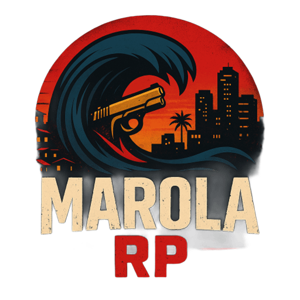

<p align="center">
   
</p>

<p align="center">
   <a href="https://discord.gg/mHrjCvMGBc"></a>
   <a href="https://github.com/Samurai33/MRP"></a>
   
   <a href="https://github.com/Samurai33/MRP/commits/main"></a>
   
</p>

# Marola RP

Bem-vindo ao **Marola RP** — um servidor brasileiro de Roleplay para FiveM, desenvolvido por Samurai, com foco em imersão, diversão, economia dinâmica, empregos variados, facções, veículos brasileiros, eventos, integração com Discord e administração profissional.

---


## ✨ Sobre o Projeto
O **Marola RP** é um servidor de Roleplay brasileiro para FiveM, com foco em realismo, diversão, economia viva e comunidade ativa. O projeto traz sistemas avançados, empregos legais e ilegais, facções, veículos nacionais, eventos, integração com Discord, administração profissional e suporte à comunidade.

**Diferenciais:**
- Projeto proprietário e fechado
- Atualizações frequentes
- Comunidade ativa e suporte
- Documentação detalhada
- Scripts otimizados para desempenho
- Painel administrativo web (em breve)

<details>
<summary><strong>Índice</strong></summary>

- [Funcionalidades Principais](#-funcionalidades-principais)
- [Trabalhos Legais](#-trabalhos-legais)
- [Trabalhos Ilegais e Facções](#-trabalhos-ilegais)
- [Modelos de Carros Brasileiros](#-modelos-de-carros-brasileiros)
- [Instituições Policiais](#-instituições-policiais-e-suas-funções)
- [Instalação](#️-instalação)
- [Como Jogar](#-como-jogar)
- [Contribuindo](#-contribuindo)
- [Licença](#-licença)
- [Contato](#-contato)
- [Agradecimentos](#-agradecimentos)

</details>

---


## 🚀 Funcionalidades Principais
- Economia realista e balanceada
- Sistema de empregos legais e ilegais
- Facções organizadas (CV, PCC, Milícia, CyberCrew, Gangues)
- Missões, eventos e conquistas exclusivas
- Customização de personagens, roupas e veículos
- Propriedades, garagens e sistema de casas
- Inventário, crafting e sistema de drogas
- Administração intuitiva e logs avançados
- Integração com Discord, logs automáticos e webhooks
- Sistema de voz (VOIP) integrado
- Scripts otimizados para melhor desempenho
- Suporte a plugins e expansões
- Painel administrativo web (em breve)
- Sistema de logs e auditoria
- Suporte a eventos sazonais e RP temático

---

## 👮 Trabalhos Legais
### Serviços Públicos
- Polícia Militar (PM)
- Polícia Civil (PC)
- Polícia Federal (PF)
- Guarda Municipal (GM)
- SAMU (Serviço de Atendimento Móvel de Urgência)
- Corpo de Bombeiros

### Transporte e Serviços
- Taxista
- Motorista de Ônibus
- Caminhoneiro
- Entregador (Sedex, Gás, Água, Delivery)
- Motorista de Aplicativo

### Indústria e Agricultura
- Lenhador
- Minerador
- Agricultor
- Leiteiro
- Pescador

### Serviços Urbanos
- Lixeiro
- Encanador
- Mecânico
- Imobiliária
- Garçom
- Barbeiro
- Vendedor de Loja

### Outros
- Caçador
- Segurança Particular
- DJ/Animador de Eventos

## 🕵️ Trabalhos Ilegais
### Atividades Individuais
- Traficante de Drogas
- Contrabandista de Armas
- Assaltante de Bancos e Caixas Eletrônicos
- Roubos a NPCs e Estabelecimentos
- Roubos de Veículos
- Roubos de Cargas
- Prosegur (Carro Forte)
- Falsificador de Documentos
- Ladrão de Joias
- Pirata Digital (Hacker Freelancer)

### Facções Criminosas e Produção

#### Comando Vermelho (CV)
- Produz e distribui drogas (maconha, cocaína, crack)
- Domina territórios e pontos de venda
- Realiza roubos organizados a bancos, joalherias e cargas
- Extorsão de comerciantes e moradores
- Lavagem de dinheiro

#### Primeiro Comando da Capital (PCC)
- Tráfico de armas e drogas (importação/exportação)
- Sequestros e resgates
- Roubos a bancos e carros-fortes
- Controle de presídios e influência sobre outras facções
- Produção de documentos falsos

#### Milícia
- Cobrança de "proteção" em áreas dominadas
- Controle de serviços clandestinos (gás, internet, transporte)
- Roubos, extorsão e lavagem de dinheiro
- Produção de armas artesanais

#### Facção de Hacking (CyberCrew)
- Invasão de sistemas bancários e governamentais
- Roubo e venda de dados pessoais
- Clonagem de cartões e fraudes digitais
- Ataques a sistemas policiais e empresas
- Produção de softwares maliciosos

#### Gangues Locais
- Roubos de rua, furtos e pichação
- Pequeno tráfico de drogas
- Produção de armas caseiras
- Controle de áreas menores e disputas territoriais

### Missões de Facção
- Dominação de territórios
- Ataques a rivais
- Roubos coordenados
- Lavagem de dinheiro

---

### Veículos Brasileiros e Premium
- **Carros:** Volkswagen Gol, Voyage, Saveiro, Fusca, Kombi, Fiat Uno, Palio, Siena, Toro, Strada, Chevrolet Corsa, Onix, S10, Opala, Montana, Ford Ka, Fiesta, EcoSport, Ranger, Renault Sandero, Logan, Duster, Honda Civic, Fit, Toyota Corolla, Hilux
- **Motos:** Honda CG 160 Titan, CG 125 Fan, Biz 125, XRE 300, CB 500F, CB 1000R, Yamaha Fazer 250, Lander 250, MT-03, MT-07, XJ6, Suzuki GSX-S750, Hayabusa, BMW S1000RR, F 850 GS, Kawasaki Z1000, Ninja 300, Ninja ZX-6R, Harley-Davidson Iron 883, Fat Boy
- **Caminhões e Utilitários:** Mercedes-Benz, Scania, Volvo
- **Veículos de Serviço:** Viaturas policiais, ambulâncias, táxis, ônibus urbanos
- **Customização:** Rodas, pinturas, acessórios, som automotivo
- **Exclusivos:** Carros e motos para VIPs e eventos especiais

---

## 🏢 Instituições e Funções

### Polícia Militar (PM)
- Patrulhamento ostensivo, abordagens, blitz, repressão ao crime
- Apoio em grandes eventos e operações conjuntas
- Controle de manifestações e distúrbios

### Polícia Civil (PC)
- Investigação criminal, inteligência policial
- Cumprimento de mandados, operações especiais
- Elaboração de inquéritos e perícias

### Polícia Federal (PF)
- Combate a crimes federais: tráfico internacional, contrabando, lavagem de dinheiro
- Operações interestaduais e internacionais
- Segurança de autoridades e fronteiras

### Guarda Municipal (GM)
- Proteção de bens públicos, fiscalização de trânsito
- Apoio à segurança urbana e escolar
- Atuação em eventos municipais

### SAMU
- Atendimento de emergências médicas
- Resgate, primeiros socorros e transporte de pacientes

### Corpo de Bombeiros
- Combate a incêndios, salvamento e resgate
- Prevenção de acidentes, vistorias técnicas
- Apoio em desastres naturais

---

## 📦 Estrutura do Projeto
```
server-data/
├── bancodedados.sql         # Banco de dados do servidor
├── config/                 # Configurações gerais
├── data/                   # Dados persistentes
├── resources/              # Scripts e assets do servidor
│   ├── [empregos]          # Scripts de empregos
│   ├── [roubos]            # Scripts de atividades ilegais
│   ├── [veiculos]          # Veículos brasileiros
│   ├── [sistema]           # Sistemas centrais (inventário, crafting, etc.)
│   └── ...
├── start.bat / start2.bat  # Inicialização do servidor
└── server.png              # Banner/logo
```

---

## 🛠️ Instalação
1. **Clone o repositório:**
   ```bash
   git clone https://github.com/seu-usuario/marola-rp.git
   ```
2. **Configure o ambiente:**
   - Instale o [FiveM Server](https://fivem.net/)
   - Copie a pasta `server-data` para a raiz do seu servidor
3. **Banco de dados:**
   - Importe o `bancodedados.sql` para seu MySQL/MariaDB
4. **Configuração:**
   - Edite os arquivos em `config/` conforme necessário
5. **Inicie o servidor:**
   - Execute `start.bat` (Windows) ou `./start.sh` (Linux)

---

## 💡 Como Jogar
- Entre no servidor pelo FiveM usando o IP fornecido
- Crie seu personagem e escolha seu caminho (legal ou ilegal)
- Participe de eventos, missões e interaja com a comunidade
- Siga as regras para garantir uma boa experiência para todos

---

## 🤝 Contribuindo
1. Faça um fork do projeto
2. Crie uma branch (`git checkout -b feature/nova-funcionalidade`)
3. Commit suas mudanças (`git commit -am 'feat: nova funcionalidade'`)
4. Push para a branch (`git push origin feature/nova-funcionalidade`)
5. Abra um Pull Request

---

## 📝 Licença
Este projeto é proprietário e fechado. Todos os direitos reservados a Samurai33. Veja o arquivo [LICENSE](LICENSE) para mais detalhes.

---


## 👨‍💻 Desenvolvedor
- **Samurai**
   - GitHub: [Samurai33](https://github.com/Samurai33)
   - Discord: [Marola RP](https://discord.gg/mHrjCvMGBc)
   - Email: contato@marolarp.com

---


## 📫 Contato & Links Úteis
- Email: contato@marolarp.com
- Discord: [Marola RP](https://discord.gg/mHrjCvMGBc)
- Site: [marolarp.com](https://marolarp.com)
- GitHub: [Samurai33/MRP](https://github.com/Samurai33/MRP)

---


## ⭐ Agradecimentos
Agradecemos a todos os colaboradores, jogadores, comunidade open source e aos desenvolvedores de recursos utilizados neste projeto!

---

<p align="center">
   <sub>Feito com ❤️ por Samurai33 e comunidade Marola RP • 2025</sub>
</p>

---
